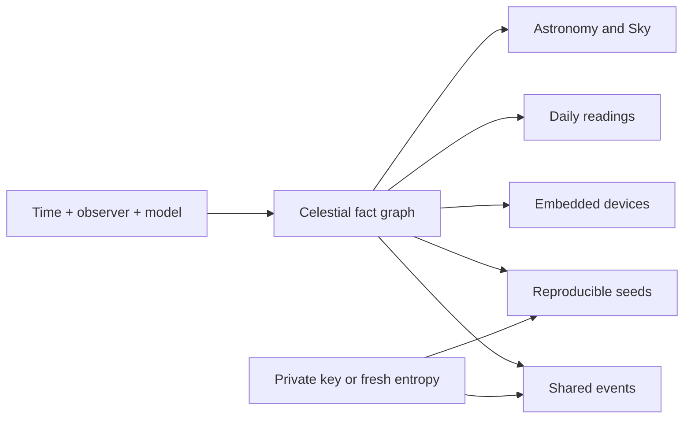

# Celestial fact engine direction

**Date:** 2026-08-13
**Status:** direction, not a gate. Captures the maintainer's product and
architecture sketch plus the assistant's analysis.
**Position:** superseded on two points the same day; see the later update.

## Later update, same day: the engine is Turquet

The engine is named **Turquet**, after the torquetum, and lives at
`merely-made/turquet` (`repos/turquet` locally): a history-preserving
adoption of `saurvs/astro-rust` with its own founding README, roadmap, and
provenance record. That resolves this document's incubation posture early:
the engine did not wait for the boundary proof to become a repo, and the
promotion question is now Turquet's roadmap rather than a Cleromancy
decision. The composition question also resolved concretely: Turquet's
`apparent` module reaches every Horizons golden value within 2 millidegrees
using only inherited code, so the pure-Rust engine needs no external crate at
all, and Cleromancy's `analytic-ephemeris` feature is a thin rev-pinned
adapter over it. The maintainer additionally directed that the DE440s kernel
engine is retained as the accuracy oracle rather than removed, and that the
remaining ANISE composition interest is its typed astrodynamics
infrastructure, hifitime time scales and frames, as Turquet's T2 candidates,
not its kernel. The first boundary proof below stands, now phrased as: one
canonical Turquet Sun state consumed by a Today explanation and a `no_std`
solar example.

## The idea

A deterministic system that can calculate, relate, search, explain, and
canonically encode facts about the sky. The engine stays scientifically
neutral: astronomy, astrology, embedded control, procedural seeds, and social
rituals are projections over the same facts.



## The engine's contract

Every result carries more than a number:

- value and units
- time scale and reference frame
- observer and location
- model and data revision
- supported range and estimated uncertainty
- dependency graph showing how it was calculated
- stable canonical encoding and digest

First-class result types:

- **State:** where is a body, how is it moving, relative to what
- **Relation:** the angular or physical relationship between bodies
- **Event:** when a condition begins, peaks, crosses, or ends
- **Window:** when something is visible, active, efficient, or relevant
- **Explanation:** which observations, conventions, and rules produced this

The explanation object is the hinge. It serves scientific reproducibility,
astrology's show-why, embedded diagnostics, social receipts, and
deterministic seeding at once.

## What already exists, mapped onto this

This contract is the receipt discipline Cleromancy already practices,
generalized from divination to sky facts. The A0 receipt separates context,
qualification, selection, and interpretation; the fact engine separates time
plus observer plus model from fact from projection.

| Contract element | Existing form |
| --- | --- |
| Model and data revision | `AstrologyChart` engine strings already pin `merely-made/anise@rev` and `merely-made/astro-rust@rev` |
| Canonical encoding and digest | integer-millidegree chart contract, `canonical_digest`, content addressing throughout |
| State | both ephemeris engines, ten bodies, measured against Horizons |
| Relation | `AstrologyFacts` aspects with explicit orbs |
| Explanation | the Workings disclosure and the replay culture |
| Deterministic seeding | `DerivedSelection` already hashes public seed and domain with domain separation |
| Uncertainty and range | **missing**; see gaps |

Genuinely new machinery, in rough order of appearance:

1. **Range and uncertainty as data.** Neither engine range-checks today. The
   truncated Pluto series is stated for 1885 to 2099 and VSOP87D degrades
   outside a few millennia of J2000; DE440s covers 1849 to 2150. A fact
   outside its model's supported range must say so instead of degrading
   silently.
2. **Topocentric layer.** Everything today is geocentric. Rise and set,
   visibility windows, the solar-panel Sun vector, and houses all need
   sidereal time plus observer geodetics. This is small, well-known math and
   it is the single gate in front of most of the Sky and Devices surfaces.
   Houses stay excluded until this layer exists, which resolves the A13
   exclusion cleanly rather than by fiat.
3. **Event finding.** Root-finding over time for ingresses, exact aspects,
   phases, rises, and eclipses, with the applying and separating state the
   Today surface wants.
4. **The fact graph.** States, relations, events, and windows as addressable
   nodes with dependency edges, the same shape as Cleromancy's existing graph
   truth.

## Composition and licensing

The pure-Rust composition already exists de facto: `ephemeris/analytic.rs` is
vsop87 (MIT/Apache) plus the astro-rust fork (MIT) plus SOFARS (MIT) plus
Cleromancy's own time and frame code, measured to millidegree parity against
Horizons on all ten bodies. No MPL is required for this path; MPL rides only
with ANISE and the kernel engine.

Per the module-crate-publish rule the engine stays a module until the
boundary proof passes. When promoted, the shape is a standalone repo in the
wavicle and wgpu-sibling mold: crates.io-visible deps only, no merely-made
platform dependencies, so embedded and game consumers can take it without the
stack. Core math should hold `no_std` compatibility as a design constraint
from the start; parsing, provisioning, and persistence stay `std`.

The DE440s kernel engine is now product-redundant: parity is measured and the
Horizons vectors, not the kernel, are the accuracy oracle. The maintainer
leans toward dropping it. Removal deletes the anise fork dependency, sha2 and
ureq, the provisioning download flow in the worker and chart form, and two
receipts; it is its own small slice and should be an explicit go, not a side
effect.

## The cryptographic boundary

Celestial facts are deterministic, public, and usually enumerable. They are
excellent context and terrible secrets. A birth chart, eclipse date, or named
event must never become a password by itself.

The safe construction:

```text
public_context = hash(canonical celestial facts)
instance_seed  = derive(private persona key, public_context, purpose, counter)
```

The engine supplies only `public_context`. Key custody and derivation belong
to Personae; fresh casts keep using cryptographic randomness through the
existing Cast mode. For moots, an astronomical fact can produce a memorable
rendezvous phrase or public room address, while membership still comes from
an invitation, group key, or existing Moot authority. Knowing where the
clubhouse is cannot be equivalent to possessing its key. This is the
participant-gate doctrine restated for the sky.

## Product shape

Five plain top-level surfaces, all lenses over one fact graph:

- **Today:** daily reading, explanation, reflection
- **Sky:** legitimate astronomy and observation
- **Chart:** natal structure, transits, settings, learning
- **People:** consensual comparison and shared readings
- **Devices:** solar trackers, clocks, displays, embedded consumers

**Today is the home.** Every reading opens outward into the real sky, so the
daily ritual sits on visible astronomy rather than backstage authority
theater. A reading expands all the way down:

```text
"Conversation may require revision"
  Mercury square natal Mercury
  exact separation: 89.72 deg
  configured orb: 2.0 deg
  applying
  peaks: 18:42 local
  tropical zodiac
  interpretation pack: <author>/<pack> <version>
```

This is the existing Workings disclosure scaled up, and the interpretation
packs it names are the correspondence packs A6 and A15 already anticipate:
authored content with a named author, version, mapping, and qualification
algorithm. No generated interpretation; the stop rule holds.

What Co-Star demonstrates is editorial and social, not computational: one
reason to return daily, a recognizable voice, whole-chart personalization
presented simply, compatibility as a conversation prompt, enough explanation
to make users curious. The engine does not produce that quality; authored
packs, relevance ranking, notification restraint, and interaction design do.
The counter-position is inspectability and ownership: friendship explicit,
local-first, selectively disclosed, no address-book upload.

Devices example: at this instant and location the apparent Sun vector is X; a
panel with normal Y receives Z geometric incidence. Weather, shading, motor
safety, and whether anything moves stay outside the engine.

## First boundary proof

Calculate one canonical apparent Sun state and consume it in two genuinely
different consumers:

1. a Today explanation in the headed app;
2. a `no_std` solar-panel orientation example.

Done when both consume the same canonical encoding, report the same state
digest, and neither reaches back into the other's stack. That result decides
whether this is an engine or merely another astrology adapter, and it is the
promotion gate for the standalone crate.

## Open decisions

1. The engine's name.
2. Removing the DE440s kernel engine (recommended as its own slice, explicit
   go).
3. Promotion timing and repo location after the boundary proof.
4. Interpretation-pack format, shared with the correspondence-pack design.

## Stop rule

This document decides direction, not implementation. No new crate, no
topocentric math, no event finding, no houses, no interpretation packs, and
no social or device surface begins from this document alone; each arrives as
its own dated gate with receipts.
